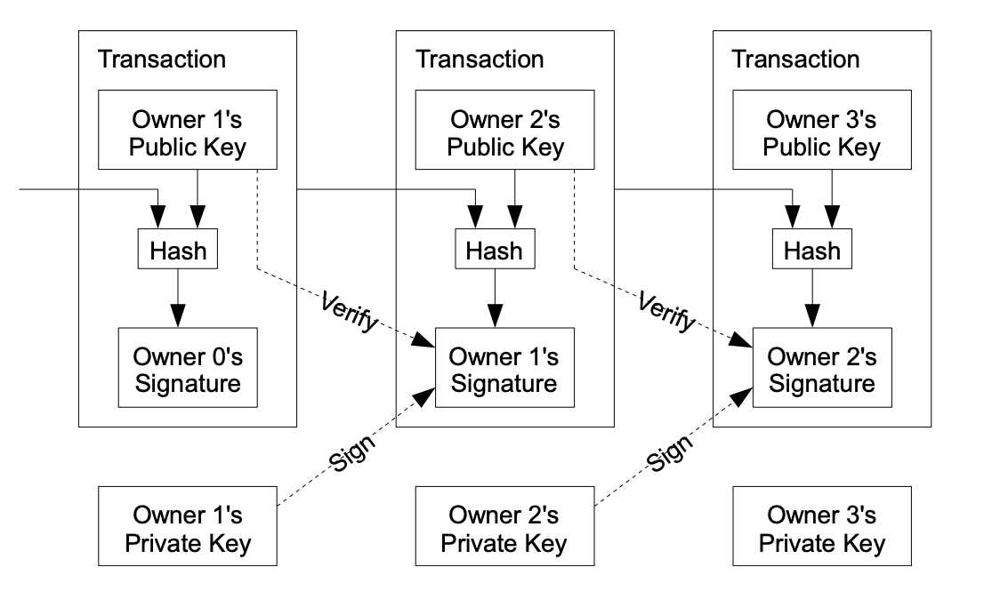

# Bitcoin White paper Summary

**Original Title:**
Bitcoin: A Peer-to-Peer Electronic Cash System

Author:
Satoshi Nakamoto

## Table of Contents
[Abstract](#abstract)
1. [Introduction](#introduction)
2. [Transactions](#transactions)

## Abstract

Peer-to-peer electronic cash would allow online payments from one party to another without going through a financial institution.  
Proposed solution to the double-spending problem using a peer-to-peer network. The network timestamps transactions by hashing them into an ongoing chain of hash-based proof-of-work, forming a record that cannot be changed without redoing the proof-of-work. The longest chain not only serves as proof of the sequence of events witnessed, but proof that it came from the largest pool of CPU power.

## Introduction

Commerce on the internet relies on financial institutions to process electronic payments, this system suffers from the inherent weakness of the trust based model. Completely non-reversible transactions are not possible, because of this the need for trust spreads. The cost of mediation increases transaction costs. A certain percentage of fraud is accepted as unavoidable.  
These costs and payment uncertainties can be avoided in person by using physical currency, but no mechanism exists to make payments over a communications channel without a trusted party.  
--> What is needed is an electronic payment system based on cryptographic proof instead of trust, allowing any two willing parties to transact directly with each other without the need for a trusted third party... The author proposes a solution to the double-spending problem using a peer-to-peer distributed timestamp server to generate computational proof of the chronological order of transactions. The system is secure as long as honest nodes collectively control more CPU power than any cooperating group of attacker nodes, *They will generate the longest chain and outpace attackers!!

## Transactions

...

