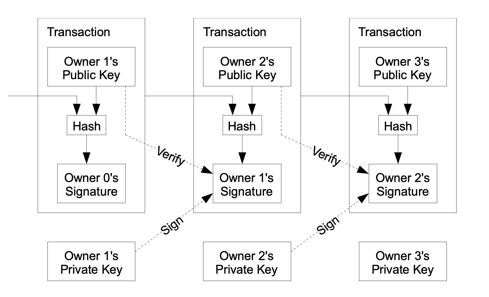
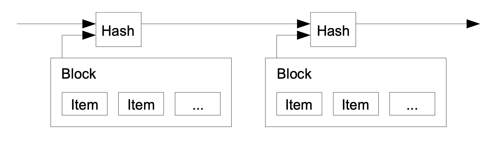

# Bitcoin White paper Summary

**Original Title:**
Bitcoin: A Peer-to-Peer Electronic Cash System

Author:
Satoshi Nakamoto

## Table of Contents
[Abstract](#abstract)
1. [Introduction](#introduction)
2. [Transactions](#transactions)
3. [Timestamp Server](#timestamp-server)
4. [Proof-of-Work](#proof-of-work)

## Abstract

Peer-to-peer electronic cash would allow online payments from one party to another without going through a financial institution.  
Proposed solution to the double-spending problem using a peer-to-peer network. The network timestamps transactions by hashing them into an ongoing chain of hash-based proof-of-work, forming a record that cannot be changed without redoing the proof-of-work. The longest chain not only serves as proof of the sequence of events witnessed, but proof that it came from the largest pool of CPU power.

## 1. Introduction

Commerce on the internet relies on financial institutions to process electronic payments, this system suffers from the inherent weakness of the trust based model. Completely non-reversible transactions are not possible, because of this the need for trust spreads. The cost of mediation increases transaction costs. A certain percentage of fraud is accepted as unavoidable.  
These costs and payment uncertainties can be avoided in person by using physical currency, but no mechanism exists to make payments over a communications channel without a trusted party.  
--> What is needed is an electronic payment system based on cryptographic proof instead of trust, allowing any two willing parties to transact directly with each other without the need for a trusted third party... The author proposes a solution to the double-spending problem using a peer-to-peer distributed timestamp server to generate computational proof of the chronological order of transactions. The system is secure as long as honest nodes collectively control more CPU power than any cooperating group of attacker nodes, *They will generate the longest chain and outpace attackers!!

## 2. Transactions

Satoshi defines an electronic coin as a chain of digital signatures. Each owner transfers the coin to the next by digitally signing a hash of the previous transaction and the public key of the next owner and adding these to the end of the coin. A payee can verify the signatures to verify the chain of ownership.

The problem is that the payee can't verify, in a decentralised way, that one of the owners did not double-spend the coin...  
For Bitcoin's purposes, the earliest transaction is the one that counts, the network doesn't care about later attempts to double-spend. The only way to confirm the absence of a transaction is to be aware of all transactions.  

**--> For the Bitcoin network to decide which transaction arrived first, it needs to be aware of all transactions. Transactions must be announced publicly, and a system is needed where participants agree on a single history of the order in which the transactions were received.**
**The payee needs proof that at the time of each transaction, the majority of nodes agreed it was the first received!!**

## 3. Timestamp Server

The solution Satoshi proposes begins with a timestamp server.  
A timestamp server works by taking a hash of a block of items to be timestamped and widely publishing the hash. The timestamp proves that the data must have existed at the time, in order to get into the hash. Each timestamp includes the previous timestamp in its hash, forming a chain, with each additional timestamp reinforcing the ones before it.

## 4. Proof-of-Work

To implement a distributed timestamp server on a peer-to-peer basis, Bitcoin will need to use a proof-of-work system. This involves scanning for a value that when hashed, such as with SHA-256, the hash begins with a number of zero bits. The average work required is exponential in the number of zero bits required and can be verified by executing a single hash.
