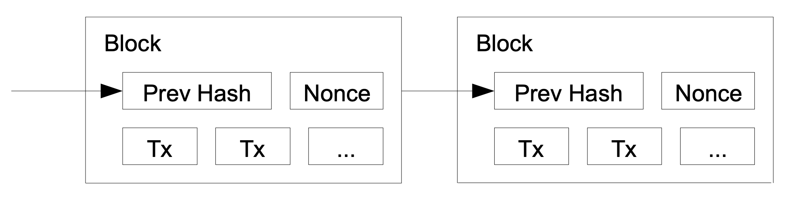
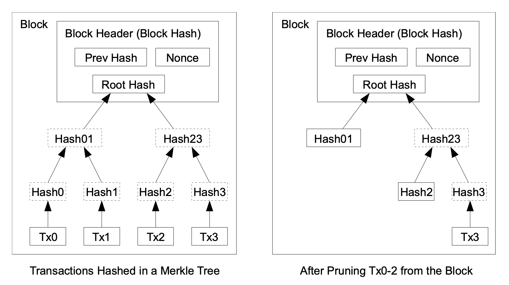

# Bitcoin White paper Summary

**Original Title:**
Bitcoin: A Peer-to-Peer Electronic Cash System

Author:
Satoshi Nakamoto

## Table of Contents
[Abstract](#abstract)
1. [Introduction](#introduction)
2. [Transactions](#transactions)
3. [Timestamp Server](#timestamp-server)
4. [Proof-of-Work](#proof-of-work)
5. [Network](#network)
6. [Incentive](#incentive)
7. [Reclaiming Disk Space](#reclaiming-disk-space)

## Abstract

Peer-to-peer electronic cash would allow online payments from one party to another without going through a financial institution.  
Proposed solution to the double-spending problem using a peer-to-peer network. The network timestamps transactions by hashing them into an ongoing chain of hash-based proof-of-work, forming a record that cannot be changed without redoing the proof-of-work. The longest chain not only serves as proof of the sequence of events witnessed, but proof that it came from the largest pool of CPU power.

## 1. Introduction

Commerce on the internet relies on financial institutions to process electronic payments, this system suffers from the inherent weakness of the trust based model. Completely non-reversible transactions are not possible, because of this the need for trust spreads. The cost of mediation increases transaction costs. A certain percentage of fraud is accepted as unavoidable.  
These costs and payment uncertainties can be avoided in person by using physical currency, but no mechanism exists to make payments over a communications channel without a trusted party.  
--> What is needed is an electronic payment system based on cryptographic proof instead of trust, allowing any two willing parties to transact directly with each other without the need for a trusted third party... The author proposes a solution to the double-spending problem using a peer-to-peer distributed timestamp server to generate computational proof of the chronological order of transactions. The system is secure as long as honest nodes collectively control more CPU power than any cooperating group of attacker nodes, *They will generate the longest chain and outpace attackers!!

## 2. Transactions

Satoshi defines an electronic coin as a chain of digital signatures. Each owner transfers the coin to the next by digitally signing a hash of the previous transaction and the public key of the next owner and adding these to the end of the coin. A payee can verify the signatures to verify the chain of ownership.

The problem is that the payee can't verify, in a decentralised way, that one of the owners did not double-spend the coin...  
For Bitcoin's purposes, the earliest transaction is the one that counts, the network doesn't care about later attempts to double-spend. The only way to confirm the absence of a transaction is to be aware of all transactions.  

**--> For the Bitcoin network to decide which transaction arrived first, it needs to be aware of all transactions. Transactions must be announced publicly, and a system is needed where participants agree on a single history of the order in which the transactions were received.**
**The payee needs proof that at the time of each transaction, the majority of nodes agreed it was the first received!!**

## 3. Timestamp Server

The solution Satoshi proposes begins with a timestamp server.  
A timestamp server works by taking a hash of a block of items to be timestamped and widely publishing the hash. The timestamp proves that the data must have existed at the time, in order to get into the hash. Each timestamp includes the previous timestamp in its hash, forming a chain, with each additional timestamp reinforcing the ones before it.

## 4. Proof-of-Work (POW)

To implement a distributed timestamp server on a peer-to-peer basis, Bitcoin will need to use a proof-of-work system. This involves scanning for a value that when hashed, such as with SHA-256, the hash begins with a number of zero bits. The average work required is exponential in the number of zero bits required and can be verified by executing a single hash. For the timestamp network, the proof-of-work is implemented by incrementing a nonce in the block until a value is found that gives the block's hash the required zero bits.  
**-->The goal is to find a nonce that produces a hash starting with a predetermined number of zeros. When a miner finds a valid nonce, they have "solved" the block and get to broadcast their block to the Bitcoin network.**  
Once the CPU effort has been expended to make it satisfy the proof-of-work, the block cannot be changed without redoing the work. As later blocks are chained after it, the work to change the block would include redoing all the blocks after it.

The proof-of-work also solves the problem of determining representation in majority decision making. POW is essentially one-CPU-one-vote. The majority decision is represented by the longest chain, which has the greatest POW effort invested in it. If a majority of CPU power is controlled by honest nodes, the honest chain will grow the fastest and outpace any competing chains...  
To compensate for increasing hardware speed and varying interest in running nodes over time, the POW difficulty is determined by a moving average targetting an average number of blocks per hour, preventing inflation or rapid chain growth. Approximately 1 block is created every 10 minutes, if they're generated too fast, the difficulty increases. This target (a 256-bit integer) is adjusted every **2016 blocks**, which is designed to occur approximately every two weeks (2016 x 10 minutes = 20,160 minutes ≈ 14 days).

## 5. Network

The steps to run the network are as follows:

  1) New transactions are broadcast to all nodes.
  2) Each node collects new transactions into a block.
  3) Each node works on finding a difficult proof-of-work for its block.
  4) When a node finds a POW, it broadcasts the block to all nodes.
  5) Nodes accept the block only if all transactions in it are valid and not already spent.
  6) Nodes express their acceptance of the block by working on creating the next block in the chain,using the hash of the accepted block as the previous hash.

Nodes always consider the longest chain to be the correct one and will keep working on extending it. If two nodes broadcast different versions of the next block simultaneously, some nodes may receive one or the other first. In that case , they work on the first one they received, but save the other branch in case it becomes longer. The tie will be broken when the next POW is found and one branch becomes longer; the nodes that were working on the other branch will then switch to the longer one. If a node does not receive a block, it will request it when it receives the next block and realizes it missed one.

## 6. Incentive

By convention, the first transaction in a block is a special transaction that starts a new coin owned by the creator of the block. This adds an incentive for nodes to support the network, and provides a way to initially distribute coins into circulation, since there is no central authority to issue them. The steady addition of a constant amount of new coins is analogous to gold miners expending resources to add gold to circulation. In the case of Bitcoin this is CPU time and electricity that is expended.  
The incentive can also be funded with transaction fees. If the output value of a transaction is less than its input value, the difference is a transaction fee that is added to the incentive value of the block containing the transaction. Once a predetermined number of coins have entered circulation, the incentive can transition entirely to transaction fees and be completely inflation free!!  

## 7. Reclaiming Disk Space

